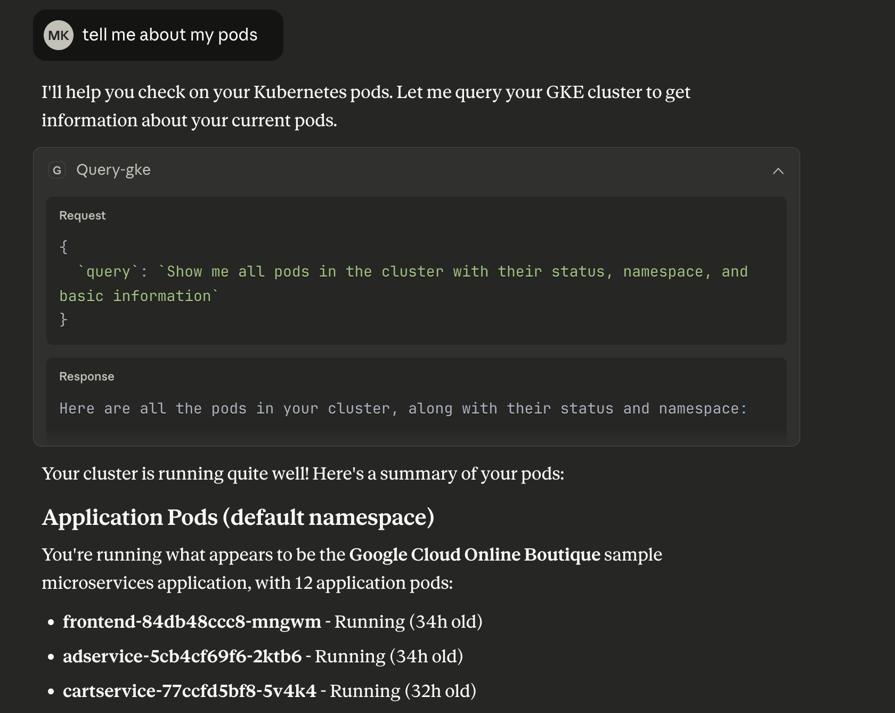

A development tool for answering questions related to your Google Kubernetes Engine (GKE) cluster. `GKE-pipelines` integrates with MCP clients, such as LLM-powered IDEs, using an MCP server.



## GKE Setup

To use the application you must have the `gcloud` CLI installed first.

Authenticate yourself by running `gcloud auth login`. Then run these commands with your Project ID and region to enable the API:

```
export PROJECT_ID=<PROJECT_ID>
export REGION=us-central1
gcloud services enable container.googleapis.com \
  --project=${PROJECT_ID}
```

If you don't already have a GKE cluster you will need to create one before using GKE-pipelines.

## Running the MCP server

Create the binary by running `go build -o bin/gke-pipelines ./cmd/main.go`

To use the MCP server provide the path to `bin/gke-pipelines-mcp`. You will also need to have the environment variable `LLM_CLIENT` and the corresponding API key set to work with [gollm](https://github.com/GoogleCloudPlatform/kubectl-ai/tree/main/gollm). Example config for Claude:

```
{
  "mcpServers": {
    "gke-pipelines": {
      "command": "<path_to_GKE_pipelines>/bin/gke-pipelines-mcp",
      "args": [],
      "env": {
        "LLM_CLIENT": "gemini"
        "GEMINI_API_KEY": "API_KEY_HERE",
      }
    }
  }
}
```